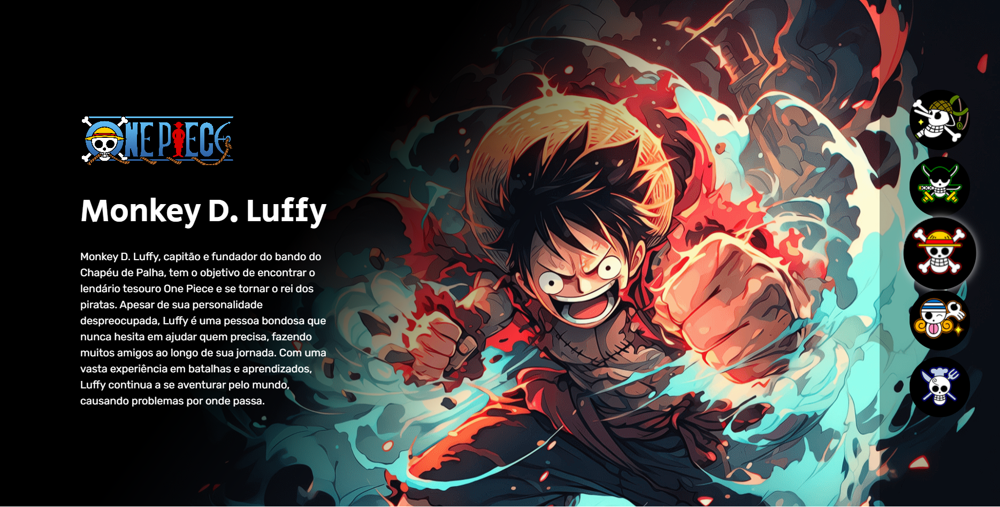

# One Piece
Um site simples com descrições e imagens dos cinco primeiros membros do bando do Chapéu de Palha.

## Tecnologias Utilizadas
- HTML
- CSS
- JavaScript (JS)
 
## Sobre o projeto
Um projeto básico para aprender na prática sobre as três linguagens de programação citadas acima, feito na Semana do Zero ao Programador do Dev em Dobro. Poucas mudanças foram feitas do projeto original.

## Funcionalidades
- Apresentação dos personagens da obra One Piece.
- Exibição de informações sobre esses personagens.

## Como Executar o Projeto
1. Clone o repositório:
   - Primeiro é necessário clonar o repositório clicando na área verde escrito < Code >, logo acima dos arquivos.
     
     ```
      https://github.com/Zabella0751/one-piece.git 
     ```
 
2. Navegue até o Diretório do projeto:
   - Após fazer a clonagem, navegue até o diretótio do projeto usando o comando 'cd'.

     ```
     cd repository-one-piece
     ```

3. Abra no seu editor de código:
   - Depois dos procedimentos acima é só abrir no seu editor de código.
  
## Spoiler do Site
- Uma imagem tirada do site para servir como uma prévia de como o projeto é.
  
 
     
